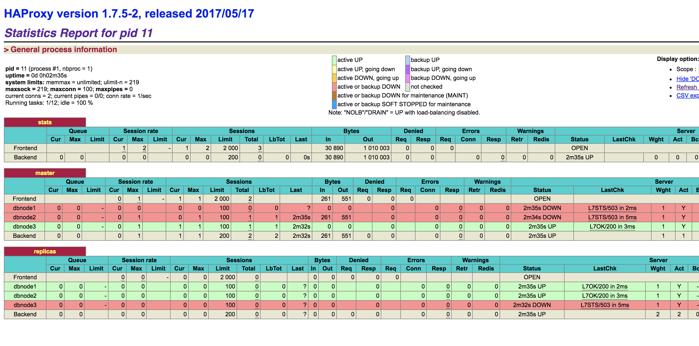
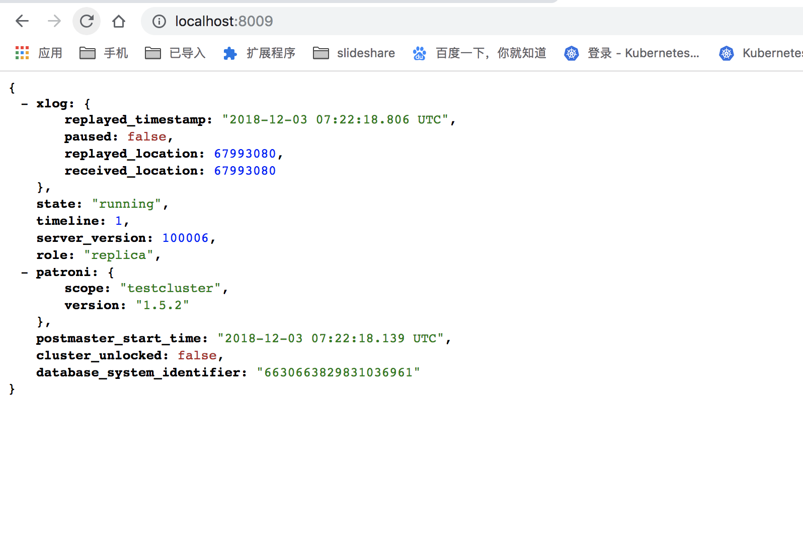
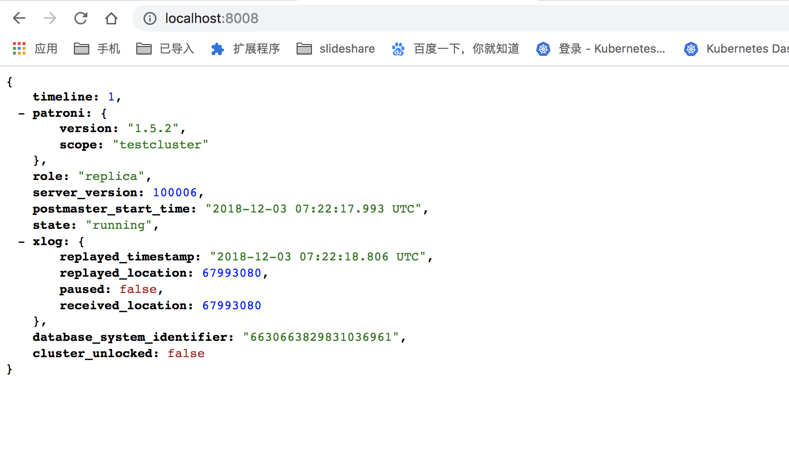
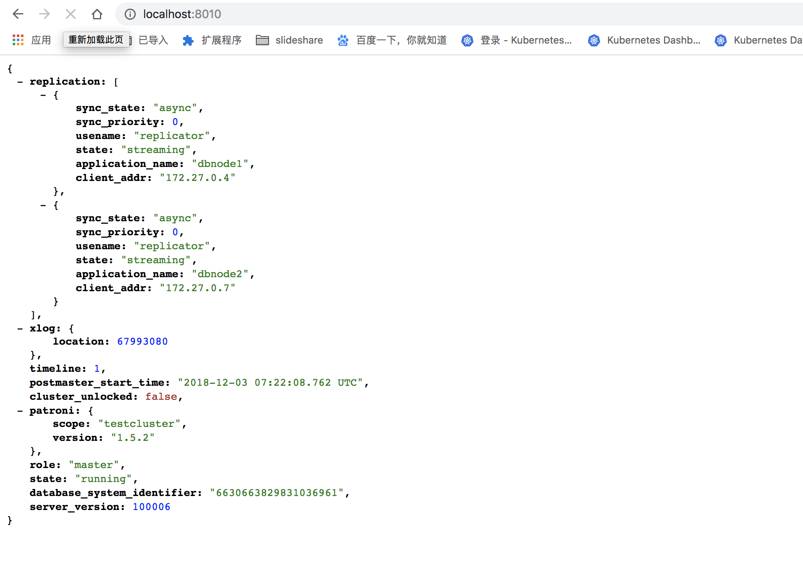
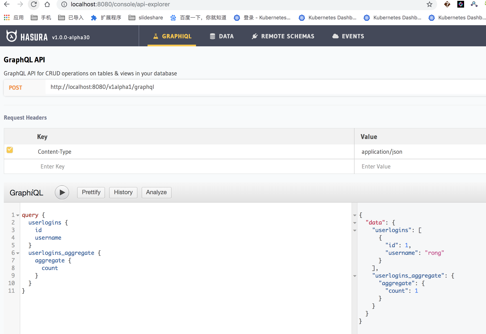

# graphql-engine with patroni ha solution


## how to run

```code
docker-compose up -d
```

## some images

* haproxy status

http://localhost:7000



* pg  status

http://localhost:80xx 





* graphql-engine ui



